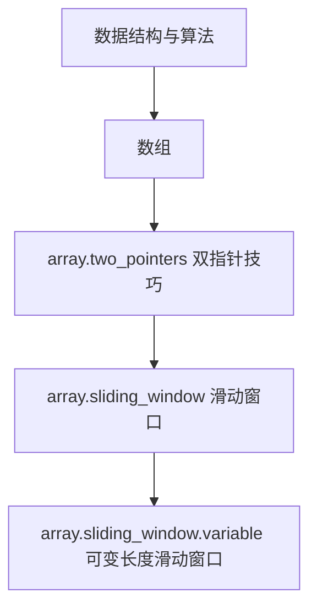

# Visualization Rules

Every explanation should include example input, initial state, key variables, state transitions, why each move is made, final result, and the reusable pattern.

## Knowledge Graph

Always output renderable JSON graph data when a problem is classified or when the user asks to view progress.

Frontend priority:

1. React Flow + Dagre
2. AntV G6
3. Cytoscape.js
4. D3.js
5. ECharts Graph
6. Mermaid fallback when no frontend renderer is available

Graph JSON must include:

- `nodes`: knowledge and problem nodes.
- `edges`: `contains`, `uses`, `related_to`, `prerequisite`, or `solved_by`.
- `highlight_path`: ordered ids from `root` to the current primary node.
- `status_colors`: mapping from learning status to visual color.
- `interactions`: booleans/capabilities for expand, collapse, details, filter, pan, zoom, and auto-centering.

Use rounded rectangles for knowledge nodes. Display status color in the node corner. Problem nodes should default to collapsed under the primary knowledge node.

If only text can be rendered, include Mermaid after the JSON:



## Array / Sliding Window

Show indexes, array cells, `L`, `R`, current window, current sum/count, answer update, expansion, and contraction.

```text
下标：  0   1   2
数组： [2] [3] [1]
        L       R
窗口：[2, 3, 1]
窗口和：6
```

## Linked List

Show nodes and pointer names such as `prev`, `cur`, `next`. Always show before/after pointer rewiring.

## Tree

Show tree shape, traversal order, and recursive call stack.

## Graph

Show adjacency, queue/stack, visited set, distance/path updates, and layer changes.

## Dynamic Programming

Show DP meaning, initialization, transition source, and table updates.

## Backtracking

Show search tree, choice, recursion, undo, and pruning reason.

## Structured Animation Data

When useful, include JSON-like steps:

```json
{
  "visualization_type": "sliding_window",
  "steps": [
    {
      "step": 1,
      "left": 0,
      "right": 0,
      "window": [2],
      "current_sum": 2,
      "action": "右指针扩张",
      "explanation": "窗口和小于 target，继续扩大窗口"
    }
  ]
}
```
